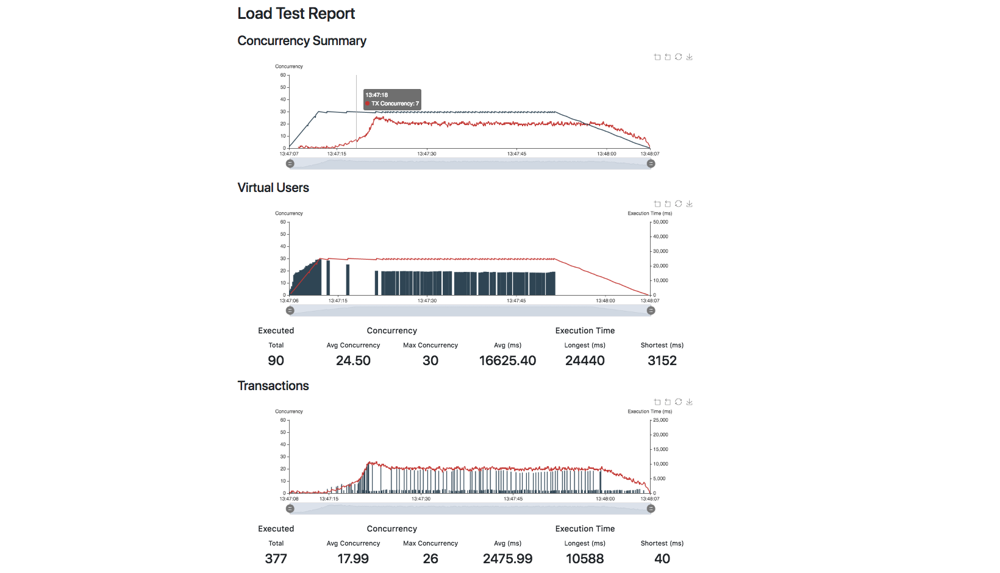

# Load Test Framework

There are currently many supporting load testing for REST APIs but there are currently none that are extremely extendable to load test services that are not running REST protocols. This framework serve to change that. Originally intended to be used for load testing private Ethereum networks, this framework can be extended to load test or benchmark any other types of services.

# Sample

The above is a screenshot from the load test of our private Ethereum network with the following configurations:

- Client: geth
- Node: 3
- Compute: AWS EC2 r5a.xlarge

The configuration for the above test is as followed:

- Concurrency (VUs): 20
- Ramp Period: 5 sec
- Active Preiod: 55 sec

# Todo

- Hooking up manager to report module
- CLI bootstrapping of new load test projects
- Distributed load test